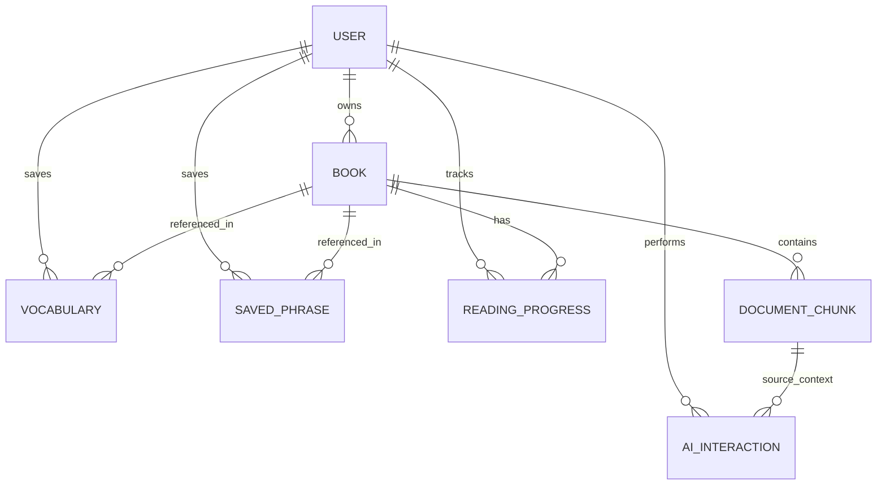

# 🗄️ EaseRead Database Architecture

This document outlines the database schema and technical strategy for EaseRead. The design prioritizes reading flow, semantic context retrieval, and usage-based scaling.

---

## 🛠️ Technical Stack
- **Primary Database**: PostgreSQL (for relational data)
- **Vector Storage**: `pgvector` extension (for book chunk embeddings)
- **Caching & IDP**: Redis (for refresh tokens and rate limiting)
- **Object Storage**: AWS S3 or compatible (for book files and generated assets)

---

## 🏗️ Entity Relationship Diagram

---

## 🗄️ Database Entities

### 1. User & Identity
Manages authentication, profile, and premium status.
- **id**: `UUID` (Primary Key)
- **email**: `CITEXT` (Unique)
- **username**: `CITEXT` (Unique)
- **name**: `String`
- **passwordHash**: `String` (Select: false)
- **tier**: `Enum` (FREE, PREMIUM)
- **aiQuota**: `Integer` (Monthly limit)
- **aiQuotaUsed**: `Integer` (Current usage)
- **createdAt / updatedAt**: `Timestamptz`

### 2. Document
Metadata for uploaded documents.
- **id**: `UUID` (PK)
- **userId**: `UUID` (FK -> User)
- **title**: `String`
- **author**: `String`
- **format**: `Enum` (EPUB, PDF, TXT)
- **fileUrl**: `String` (Storage path)
- **coverUrl**: `String`
- **isProcessed**: `Boolean` (Vector embedding status)
- **uploadedAt**: `TimeStamptz` (document uploaded at)
- **metadata**: `JSONB` (Chapter count, page count, etc.)
- **processedAt**: `Timestamptz` (When embedding completed.)
- **fileSize**: `number` (File size in bytes.)
- **totalPages**: `number`
- **wordsCount**: `number` (number of words in document (if counting possible))

### 3. DocumentChunk (Vector Support)
The core of the "AI-Assisted" reading experience.
- **id**: `UUID` (PK)
- **documentId**: `UUID` (FK -> Document/Book)
- **content**: `Text`
- **embedding**: `Vector(1536)` (Calculated via OpenAI/Local model)
- **index**: `Integer` (Sequential ordering)
- **tokenCount**: `Integer` (Nullable, token budget management)
- **chapterTitle**: `varchar` (Nullable)
- **pageNumber**: `Integer` (Nullable)
- **startOffset**: `Integer` (Nullable)
- **endOffset**: `Integer` (Nullable)

### 4. Reading Progress
Tracks the current position in a book.
- **id**: `UUID` (PK)
- **userId**: `UUID` (FK -> User)
- **bookId**: `UUID` (FK -> Book)
- **currentLocation**: `String` (CFI for EPUB, Page for PDF)
- **percentageRead**: `Float`
- **lastReadAt**: `Timestamptz`

### 5. Vocabulary (Word-Level)
Saved words for future review.
- **id**: `UUID` (PK)
- **userId**: `UUID` (FK -> User)
- **bookId**: `UUID` (FK -> Book, Optional)
- **word**: `String`
- **meaning**: `Text` (Standard dictionary definition)
- **contextSentence**: `Text` (Extracted from the chunk where saved)
- **aiExplanation**: `Text` (Premium: Context-specific insight)
- **language**: `String`

### 6. Saved Phrase (Idea-Level)
Significant quotes or complex passages.
- **id**: `UUID` (PK)
- **userId**: `UUID` (FK -> User)
- **bookId**: `UUID` (FK -> Book)
- **originalText**: `Text`
- **aiInterpretation**: `Text` (Philosophical/Emotional meaning)
- **grammarInsights**: `Text` (Optional breakdown)
- **shareCardUrl**: `String` (URL to a generated social media card)

### 7. AI Interaction Audit
Tracking and metering of AI usage.
- **id**: `UUID` (PK)
- **userId**: `UUID` (FK -> User)
- **type**: `Enum` (DEFINITION, EXPLANATION, INTERPRETATION, VISUAL)
- **tokensUsed**: `Integer`
- **response**: `Text`
- **createdAt**: `Timestamptz`

---

## 🚀 Performance & Scaling Strategies

1. **Context-Aware Retrieval**:
   - When text is selected, we fetch the containing `BookChunk` and its immediate neighbors (`index ± 1`) to provide the AI with surrounding context without excessive tokens.
   - For deeper insights, `pgvector` HNSW indexes allow sub-millisecond similarity search across individual books.

2. **Database Resilience**:
   - Use `CITEXT` for case-insensitive uniqueness on emails/usernames at the DB level.
   - Index the `userId` + `bookId` columns on all interactive tables (`Vocabulary`, `SavedPhrase`) for instant filtering during reading sessions.

3. **Background Processing**:
   - Large book uploads trigger a queue (BullMQ/Redis) to handle chunking and embedding asynchronously, ensuring the UI remains responsive.
